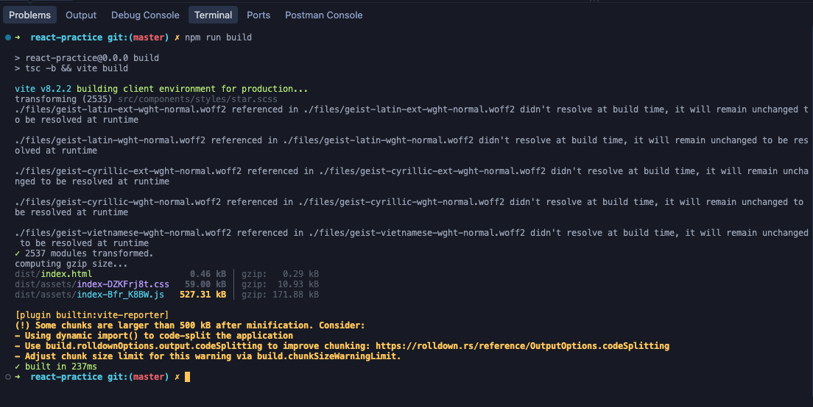

# React Practice exercises

A series of small exercises based on Typescript, React for practice. Concepts include:

- reducer pattern
- debounce
- state management
- redux

https://react-practice-lac-eight.vercel.app/

No UI polish. Core dependencies:

- TailwindCSS
- Shadcn
- Vite
- Date-fns for date conversion heavy lifting

### No AI-generated code here.

There is a known bundling size issue which I'm ignoring for now.

